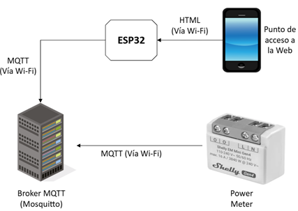
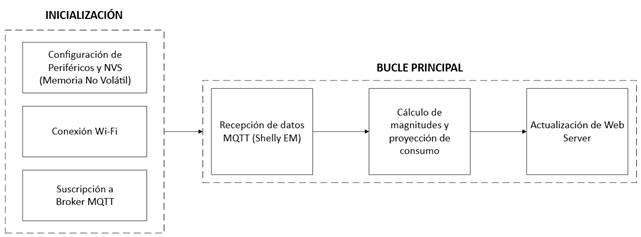
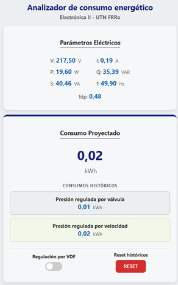

# Medidor de Energía Inteligente
**Cátedra:** Electrónica II - UTN FRRo
**Integrantes:** Fabricio Cetraro, Didier Lafitte  
**Docentes:** Ing. Marcelo Castello, Ing. Lucas D'allessandro

---

## 1. Requerimientos del Sistema (Punto de Partida)
Para el desarrollo de este proyecto se establecieron los siguientes requerimientos funcionales:
* **Monitoreo energético**: captura en tiempo real de parámetros eléctricos (V, I, P, f) de bombas centrífugas.
* **Persistencia (NVS)**: almacenamiento físico de acumulados históricos (kWh) mediante la librería `Preferences.h` para evitar pérdida de datos ante cortes de energía.
* **Interfaz HMI asíncrona**: provisión de un panel web mediante `ESPAsyncWebServer` que permita la consulta de datos y cambio de modos sin bloquear el microcontrolador.
* **Diferenciación de regímenes**: capacidad de segmentar el consumo proyectado en dos modos: VDF (Variador de Frecuencia) y Válvula.

## 2. Arquitectura del Hardware

### Unidad de procesamiento
Se utiliza un microcontrolador **ESP32** como cerebro del sistema por su conectividad Wi-Fi integrada. Es el encargado de suscribirse al broker MQTT para recibir los datos del sensor y de servir la página web de forma asíncrona. Gestiona la memoria **NVS** para que los datos de consumo no se pierdan al apagar el equipo.

### Sensor 
Se utiliza un medidor de energía inteligente **Shelly EM Mini Gen4** como el elemento sensor del sistema. Este mide tensión, corriente y potencia de las bombas y envía la información empaquetada en formato **JSON**. Se comunica con el ESP32 de forma inalámbrica a través del protocolo **MQTT**.

### Almacenamiento y visualización
* **Persistencia (NVS)**: se usa una parte de la memoria flash del ESP32 para guardar los históricos.
* **Interfaz (HMI)**: la visualización se realiza mediante una interfaz web accesible desde el navegador de cualquier PC o celular conectado a la red LAN.
* **Broker (Mosquitto)**: se requiere un servidor intermedio que gestione el tráfico de mensajes entre el sensor y el microcontrolador.

### Diagrama en bloques de hardware

## 3. Desarrollo del firmware

### Diagrama en bloques funcional

### Bloque de inicialización (Setup)
Es la etapa donde el microcontrolador prepara todos sus recursos antes de empezar a medir. 

* **Configuración de NVS**: se activa la partición de memoria no volátil para recuperar los datos históricos de consumo guardados antes del último apagado. Utilizamos la librería `Preferences.h` para gestionar la partición NVS del ESP32.
* **Gestión de red**: se establece la conexión Wi-Fi utilizando las credenciales cargadas en el archivo `config.h`.
* **Suscripción MQTT**: se inicializa con la librería `PubSubClient.h` para gestionar la conexión con el broker Mosquitto y suscribirse a los tópicos del sensor Shelly EM.

### Bucle principal
Una vez iniciado, el sistema entra en un ciclo infinito de procesamiento reactivo. 

* **Procesamiento de datos**: el ESP32 recibe los mensajes del sensor en formato **JSON**, los "desarma" y realiza los cálculos de potencia y proyección de consumo; los mensajes recibidos del Shelly EM se procesan con la librería `ArduinoJson.h`. 
* **Mantenimiento de enlace**: en cada ciclo se verifica que el enlace Wi-Fi y MQTT sigan activos; si algo falla, el sistema intenta reconectarse automáticamente sin detener el resto de las tareas.

## 4. Interfaz de usuario 

La visualización y el control del sistema se realizan mediante una interfaz web accesible desde cualquier dispositivo conectado a la red local. Se ingresa mediante la dirección IP asignada al ESP32 en la red Wi-Fi. 

La web muestra en tiempo real los valores de tensión, corriente y potencia. Además, permite conmutar entre los modos "VDF" y "Válvula" mediante un switch lógico, lo que dispara la persistencia de datos en la memoria NVS. A su vez, la página se actualiza dinámicamente sin necesidad de recargar todo el sitio, manteniendo la fluidez del sistema.

## 5. Conclusiones

Se logró integrar un medidor comercial (Shelly EM) con un nodo de procesamiento basado en ESP32, validando la interoperabilidad de dispositivos mediante el protocolo MQTT. 

La implementación de la memoria NVS demostró ser eficaz para salvaguardar los datos históricos de consumo, cumpliendo con el requerimiento de inmunidad ante cortes de energía.

Por último, el uso de un servidor web asíncrono permitió una visualización fluida y en tiempo real de los parámetros eléctricos, garantizando que el sistema sea reactivo y no bloqueante durante la operación crítica del microcontrolador.